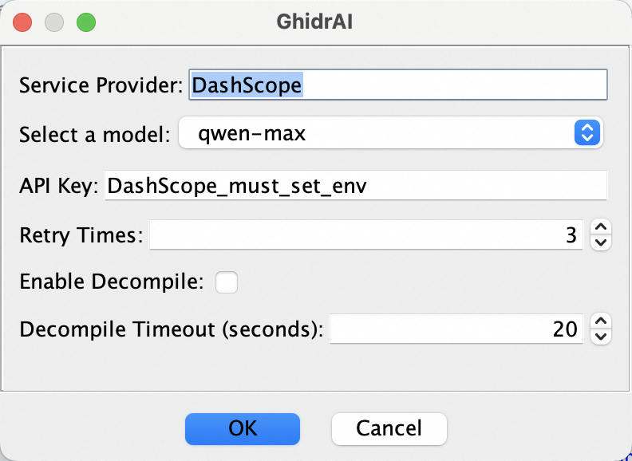
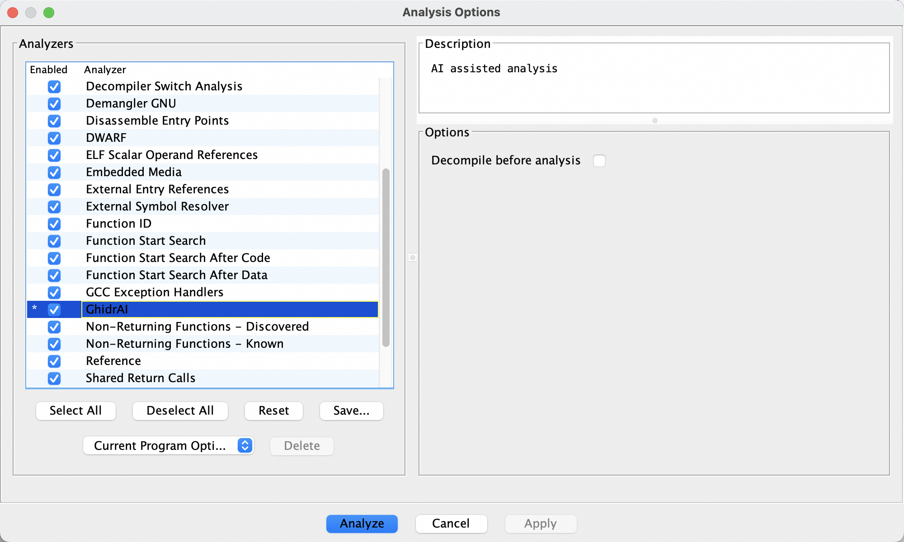
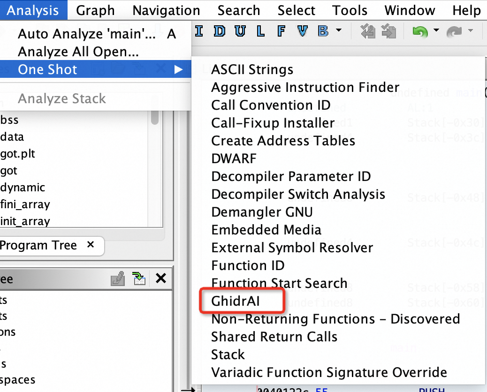

# GhidrAI

[](LICENSE.txt)

GhidrAI is a Ghidra extension which uses [Alibaba Cloud LLM][AliyunURL] services explain what a function does, and to automatically rename its variables. Most importantly, these services are free :)

## Requirements

The GhidrAI is verified on Ghidra 10.4.
Note: Ghidra 10.4 requires [JDK 17 64-bit](https://adoptium.net/temurin/releases/).

## Building GhidrAI

Use the following steps to build GhidrAI for your environment:

- Install Ghidra using the documentation [here](https://htmlpreview.github.io/?https://github.com/NationalSecurityAgency/ghidra/blob/stable/GhidraDocs/InstallationGuide.html#InstallationNotes)
- Install Gradle from [here](https://gradle.org/releases)
- Download the latest GhidrAI source release from [here](https://github.com/Forsworns/GhidrAI)
- Run the following command from the GhidrAI source directory:
    * **Note:** you may optionally set an environment variable named GHIDRA_INSTALL_DIR instead of specifying -PGHIDRA_INSTALL_DIR
```
$ gradle -PGHIDRA_INSTALL_DIR=<absolute path to Ghidra install>
```

This command builds GhidrAI. If successful, you will find a new directory in your GhidrAI source directory named `dist` containing your GhidrAI extension (`.zip`). Please open a new issue if you experience any issues. (Please provide the log file at `~/.ghidra/.ghidra_${VERSION}/application.log`.)

## Installing GhidrAI

Use the following steps to install your GhidrAI extension in Ghidra:

- **Note:** For [Alibaba Cloud DashScope][AliyunURL], you must use the `DASHSCOPE_API_KEY` environment variable.
- Start Ghidra
- Navigate to `File > Install Extensions...`
- Click the green `+` button
- Navigate to your GhidrAI extension built earlier (`.zip`)
- Click `Ok`
- Restart Ghidra

**OR**

You can extract your GhidrAI extension (`.zip`) directly to `<absolute path to Ghidra install>\Ghidra\Extensions` and Ghidra will prompt you to configure GhidrAI the next time it is started.

## Using GhidrAI
Select the function and right click the mouse, you can find the option in the menu.


Click `Tools > GhidrAI`, and you can find the configruation dialog. For more detailed information, refer [data/README.md](data/README.md).



GhidrAI also provides an automatic analyzer, you can find it in `Analysis > Auto Analyze ...` or `Analysis > One Shot`.





## Acknowledgment

This project refers to the [Ghidrathon](https://github.com/mandiant/Ghidrathon) plugin, which provides out-of-box Python3 integrations for Ghidra. My original idea is to utilize Ghidrathon to run LLMs locally. But directly requesting services such as [Alibaba Cloud DashScope][AliyunURL] saves my time.

And apparently the idea is from [Gepetto](https://github.com/JusticeRage/Gepetto).

[AliyunURL]: https://help.aliyun.com/zh/dashscope/developer-reference/activate-dashscope-and-create-an-api-key
